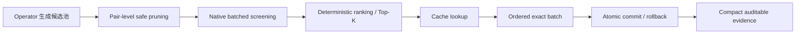

# Stage 5.2 最新版本性能改进建议

## 结论

就最新版本而言，最佳改进方向不是先重写 CUDA exact solver（CUDA 精确求解器），而是重构：

> `route_merge → candidate pool → screening transaction → exact batch`

也就是把现在“逐候选、逐路线、逐次跨 Python/C++ 边界”的执行方式，改成真正的 candidate transaction pipeline（候选事务流水线）。

本文分析基于 `stage05.2_benchmark_attempt92` 已归档的 217 个 100-customer shard（651 个轴）。Formal 运行在分析时仍未完成审核，因此这些属于性能诊断证据，不是最终 readiness（就绪性）结论。

## 为什么这是第一优先级

| attempt92 中位数 | 30 秒 | 60 秒 | 300 秒 |
|---|---:|---:|---:|
| screening 占运行时间 | 42.9% | 46.1% | 48.6% |
| 真正 C++ screening kernel 占 screening | 7.0% | 6.0% | 5.6% |
| negative-cache hit（负缓存命中） | 78.2% | 82.3% | 82.2% |
| exact backend 占运行时间 | 4.84% | 3.87% | 3.15% |
| exact batch median occupancy | 1 | 1 | 1 |

这些数据说明：

- screening 很慢，但主要不是筛选数学本身慢。
- 约 93%–94% 的 screening 时间花在 Python transaction overhead（事务开销）、缓存操作、对象构造、route registration（路线注册）和 trace（追踪记录）上。
- exact charging 即使无限快，端到端通常也只能提高约 3%–5%。
- 当前 `batch_size=128` 基本没有真正形成批次：每次 launch（启动）平均只有约 1.07–1.10 条路线。

更明显的是，当前 100-customer 诊断中的 76,804,004 条 neighborhood event（邻域事件）里：

- `route_merge / capacity_prefilter`：48,931,342 条；
- `route_merge / forward_time_window_prefilter`：26,935,640 条；
- 两者合计占全部 neighborhood event 的 **98.78%**。

所以真正热点是 `route_merge` 反复构造大量必然被 capacity/time-window（容量／时间窗）拒绝的排列，而不是 GPU 没有被调用。

## 最好的改进顺序

### 1. 消除 `route_merge` 的结构性重复计算

当前代码对每个 route pair（路线对）依次枚举：

1. 两个拼接方向；
2. 每个 insertion position（插入位置）；
3. 每个结果单独运行 screening；
4. 每个拒绝结果生成一条 Python event。

但同一 pair 的总 demand（需求量）不随插入位置变化。因此应当：

- 在生成所有 insertion candidates（插入候选）之前，先做一次 pair-level capacity gate（路线对级容量门控）。
- 如果容量不可能满足，直接跳过该 pair 的全部排列。
- 用一个 aggregate event（聚合事件）保留被跳过的候选数量和确定性 hash，而不是构造大量等价事件。
- 为 `route_merge` 增加 cached forward/backward profiles（缓存的前向／后向传播轮廓），避免每个插入位置重新扫描整条路线。

这是最安全、收益最直接的一步，因为它属于 mathematically safe pruning（数学安全剪枝），不需要改变 objective（目标函数）或候选排序语义。

### 2. 把完整 screening transaction 下沉到 C++

当前 `screen_routes_numeric()` 实际上一次只处理一条路线。应新增类似下面的批量接口：

```text
screen_route_batch_transaction(
    route_offsets,
    route_indices,
    candidate_ids,
    instance_context,
    cache_state
)
```

一次完成：

1. canonical route identity（规范路线身份）；
2. batch deduplication（批内去重）；
3. negative-cache lookup；
4. capacity、time-window、energy screening；
5. compact result arrays（紧凑结果数组）；
6. aggregate evidence counters/hash（聚合证据计数与哈希）。

Python 每轮只接收结构化数组，而不是为每个候选构造多个 Python object（对象）。

按照当前 43%–49% 的 screening 占比，即使只把整个 screening transaction 加速 10 倍，Amdahl's law（阿姆达尔定律）给出的端到端上限也约为：

- 30 秒轴：**1.63×**
- 300 秒轴：**1.78×**

这一步比直接 CUDA 化更容易验证，也能成为后续 CPU/CUDA 共用的 ABI（应用二进制接口）。

### 3. 重新接通 native kernels 与 Candidate Control

当前 `solve_alns()` 明确禁止同时启用：

```text
native_kernel_config + candidate_control_config
```

因此 Stage 5.2 虽然拥有 native kernels（原生内核），却没有使用 Stage 3.4 已有的完整 candidate-control execution（候选控制执行）。attempt92 中的 `candidate_control_statistics` 也是空的。

不能简单删除这个检查。正确做法是增加明确的 `NativeCandidateTransactionRuntime`：



它必须继续保证：

- candidate order（候选顺序）确定；
- vehicle-first lexicographic objective（车辆数优先字典序目标）不变；
- deadline/budget transaction（截止时间／预算事务）原子；
- cache commit/rollback（缓存提交／回滚）可重放；
- 没有隐藏 fallback（回退）。

### 4. 达到足够 occupancy 后再接 CUDA

CUDA 最合理的第一落点不是 exact charging，而是 batched screening：

- 一个 warp（线程束）处理一条路线；
- 按路线长度分桶，降低 warp divergence（线程束分歧）；
- instance matrix（实例矩阵）常驻显存；
- 使用 pinned memory（页锁定内存）或 shared-memory ring buffer（共享内存环形缓冲区）；
- 六个 CPU shard worker 向一个 GPU service（GPU 服务）提交任务；
- GPU service 跨 shard 进行 micro-batching（微批处理）；
- 达到 32、64 或 128 条路线再执行，而不是每条路线单独 launch。

只有在 median occupancy 从当前的 1 提高到至少 32 后，CUDA 才真正值得比较。这也和项目现有的 occupancy threshold（占用度阈值）一致。

第一版 CUDA 仍应让 exact charging 留在 CPU：

```text
CPU：ALNS control + operator generation + exact charging
GPU：大批量 capacity/time-window/energy screening
```

后续如果 profiling（性能剖析）证明 exact charging 占比重新上升，再考虑 persistent kernel（持久化内核）或 warp-per-route label search（每路线一线程束标签搜索）。

## 最终优先级

1. **Pair-level `route_merge` safe pruning**：先消灭数千万次重复容量检查。
2. **Native batched screening transaction**：一次跨 Python/C++ 边界处理整个候选池。
3. **Native Candidate Control protocol**：真正形成 exact batches。
4. **Cross-shard CUDA screening service**：occupancy ≥32 后再比较 GPU。
5. **CUDA exact charging**：只有重新 profiling 后它成为主要热点才做。

## 预期收益

保守判断：

- 前三步只用 CPU，100-customer workload（工作负载）有可能达到当前版本的 **1.5–2.5×**；
- 在此基础上设计良好的 CUDA screening service，整体可能达到当前版本的 **2–4×**；
- 当前证据不支持直接声称 10× 端到端提升；
- 直接 CUDA 化现有 exact solver，预计只会获得几个百分点，而且很可能被 launch/data-transfer overhead（启动／数据传输开销）抵消。

## 实施边界

- 不应修改或干扰正在运行的 `stage05.2_benchmark_attempt92`。
- 新架构应使用新的 immutable attempt（不可变尝试）生成证据。
- 每一步都应在同一 sealed corpus（封存语料）上进行单变量 A/B comparison（对照比较）。
- 必须继续通过 objective、validator、cache、deadline、candidate order 和 replay consistency（重放一致性）门控。
